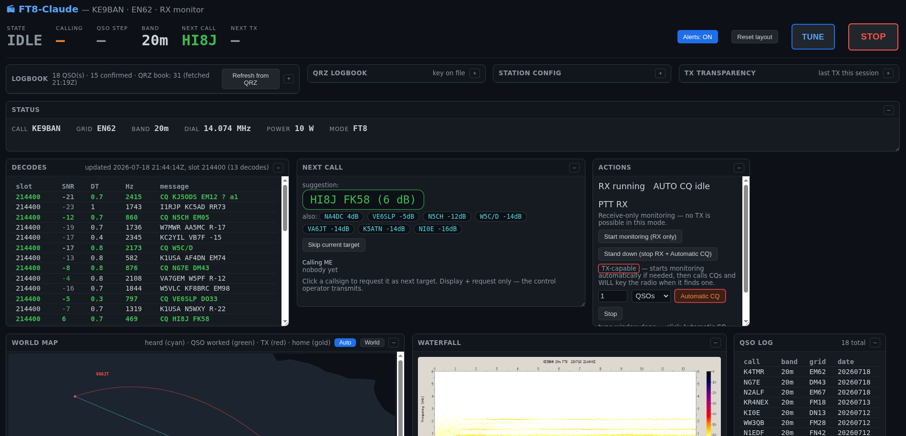
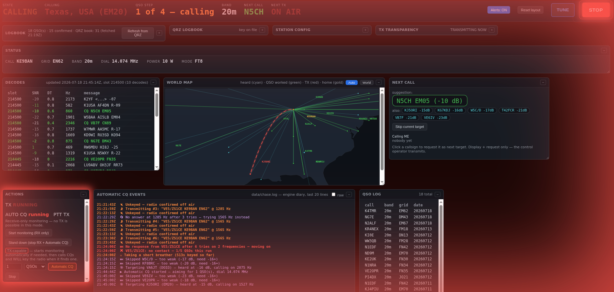

# COTA — Claude on the Air: a Claude-built FT8 station for Linux hams 📻

**A digital on-the-air system for HAM radio, built by Claude.**

[](https://github.com/d4rkd0s/cota/actions/workflows/test.yml)

**Decode, chase, and log FT8 QSOs from the command line**, with a live browser
dashboard: waterfall, offline world map, decode list, QSO log, and next-call
ranking. Born on 40 m with a Xiegu G90 + DE-19 interface at 5 W — but every
station-specific value lives in one config file, so it runs on **any
Hamlib-controllable rig** with a USB audio interface.

This station was designed, written, debugged, and first operated by Claude
(Anthropic's AI) working under a licensed ham's supervision — and then made
**claude-less at runtime**: no AI, no cloud, no tokens, no network calls. What
runs in your shack is plain bash + Python 3 + the WSJT-X command-line tools.
First contact: VE2OPC (FN45), 2026-07-04, 40 m, 5 W, worked and logged entirely
by this code while the control operator watched.

**Operating cost: $0/hour — no AI subscription needed, ever.** See
[docs/COST.md](docs/COST.md) for the measured cost model (what building it with a
frontier model actually cost, and how to hack on it for cents or for free with
local models).




## ⚠️ Safety model — read this first

**Claude does not transmit. Ever.** Claude built this software; it does not
operate it. The licensed control operator runs the commands that operate the
station (`coa start`, `coa chase N`, …) — every key-up on the air is a human
decision, executed by human-run code, never an AI acting on its own.

**You must be a licensed radio amateur, and you are the control operator.**
FCC Part 97 (and most national regulations) make a licensed operator
responsible for every transmission. This software is **attended
semi-automation** — the same class of tool as WSJT-X's auto-sequencer, not an
unattended robot. Stay at the station whenever the chaser is running.

Built-in rails, all enforced in code:

- **Answerer only — it never calls CQ.** The chaser answers other stations'
  CQs and sequences a standard QSO to 73. It initiates nothing on its own.
- **Independent unkey watchdog** armed *before* every key-up (default 14 s; an
  FT8 frame is 12.64 s). Even if the main process dies mid-frame, the watchdog
  releases PTT.
- **Frequency read-back before every key-up** — `rigctl f` must return exactly
  the configured dial, or the frame is aborted without keying.
- **PTT release verified** after every frame; a stuck PTT aborts the session.
- Same-frame **repeat cap** (default 6), per-target patience limit, and an
  absolute per-session TX frame budget.
- **No same-day dupes**, courtesy 73, even/odd slot discipline, clear-offset
  (split) calling, and breather pauses — see the etiquette section below.
- Ctrl-C, `coa stop`, and the watchdog all force-release PTT.

**QRP / duty-cycle warning:** FT8 is a 100%-duty-cycle mode for ~13 s per
frame, and a chase session keys many frames. Small rigs like the G90 run hot —
set `TX_PWR` conservatively (5–10 W), keep SWR low, and give the radio
breathing room. You are responsible for staying within your license privileges
and your hardware's limits.

## Requirements

Built and tested on Ubuntu 22.04 LTS (Jammy Jellyfish), kernel 5.15.0-185-generic —
should work on any modern Linux distro with the packages below; not tested on macOS/BSD.

- Linux with PulseAudio (or PipeWire's PulseAudio shim)
- **WSJT-X package** — this project *calls* its GPL `jt9` decoder and
  `ft8code` encoder as external programs; they are not bundled or linked
- Hamlib (`rigctl`), `sox`, Python 3 + numpy
- A CAT-controllable radio and a USB audio interface wired to it
  (DE-19, Digirig, SignaLink, built-in USB codec, …)
- An NTP-synced clock — FT8 needs < 1 s accuracy (`timedatectl`)

```bash
sudo apt-get install wsjtx sox pulseaudio-utils python3-numpy libhamlib-utils
```

## Quick start

```bash
bin/coa setup          # interactive wizard: detect hardware, write station.conf
bin/coa selftest       # offline decode-chain check — no radio needed
bin/coa doctor         # preflight diagnostics with fix-hints
bin/coa start          # preflight checks, RX loop, dashboard at http://localhost:8074
bin/coa chase 3        # answer CQs until 3 QSOs are logged — stay at the radio!
bin/coa chase 20m      # ...or chase for 20 minutes
bin/coa status         # one-screen station status
bin/coa report         # compact session report: QSOs, attempts, per-band
bin/coa stop           # stop everything, force PTT release
```

`coa start` alone is receive-only and needs no attention: it decodes, plots,
and suggests — but never transmits. Full per-distro install steps (including
Raspberry Pi OS) are in [docs/INSTALL.md](docs/INSTALL.md).

## Architecture

```
rig ──USB audio──> PulseAudio ──parecord 12 kHz──> data/slot.wav (per 15 s slot)
                                     │
                    jt9 -8 (WSJT-X CLI decoder — best sensitivity)
                    sox spectrogram → data/waterfall.png
                                     │
                    bin/rx-loop.sh → data/decodes/YYYY-MM-DD/HH.jsonl + data/status.json
                                     │
                    bin/dashboard.py (http://localhost:8074) ← your browser
                                     │
        bin/qso.py chaser: pick CQ (SNR minus pileup penalty)
        ─ft8code + GFSK synth─> TX WAV ─rigctl verify freq → key →
        paplay → unkey (independent watchdog)─> rig TX
                                     │
        QSOs ──> wsjtx_log.adi (standard ADIF — imports anywhere)
```

The GFSK modulator (`tools/ft8synth.py`) is ~100 lines of numpy built from the
FT8 spec (8-FSK, 6.25 baud, BT=2 Gaussian pulse, Costas sync), verified by
loopback against `jt9` at DT 0.00. The sequencer's pure logic is unit-tested
(`python3 tools/test_sequencer.py`).

## The dashboard

`bin/dashboard.py` is Python 3 standard library only — no frameworks, no JS
build, and **zero external requests** (the world coastline is Natural Earth
110m public-domain data embedded in `bin/world_map.py`), so it works in an
offline shack. Panels: live waterfall, world map (heard stations plotted from
their grid squares, fading over ~15 min; your QTH gold; an animated red arc to
the station being worked while the rig is keyed), decode table, callers-to-you,
QSO log, next-call suggestion, and the chaser's event diary. See it live in
the screenshots near the top of this README.

## On-air etiquette

The chaser's behavior follows the widely used
[ZL2IFB FT8 Operating Guide](https://www.g4ifb.com/FT8_Hinson_tips_for_HF_DXers.pdf)
by Gary Hinson ZL2IFB:

- **Split calling only** — picks its own clear TX offset (≥ 60 Hz clearance,
  parity-aware), never calls on the DX's frequency
- **Busy-hold** — if the target answers someone else, it holds fire instead of
  QRMing, and moves on after repeated cycles
- **Directed-CQ respect** — never answers `CQ DX` or contest CQs; answers only
  plain CQs and a configurable modifier whitelist (POTA, QRP, your region, …)
- **SNR floor** — doesn't call stations too weak to plausibly hear a QRP reply
- Stalled-QSO recovery, slot-parity tracking, and periodic breathers so it
  never dominates a frequency

## License

MIT — see [LICENSE](LICENSE). Copyright 2026 Logan Schmidt.

`jt9` and `ft8code` are part of [WSJT-X](https://wsjt.sourceforge.io) (GPL),
which you install separately from your distribution; this project invokes them
as external command-line programs and does not bundle, modify, or link against
them. Not affiliated with the WSJT-X project. World map data is Natural Earth
(public domain). Thanks to Gary Hinson ZL2IFB for the FT8 Operating Guide that
shaped the etiquette engine, and to the WSJT-X team for the mode and the tools.

---
*73 — Logan (and Claude)*
